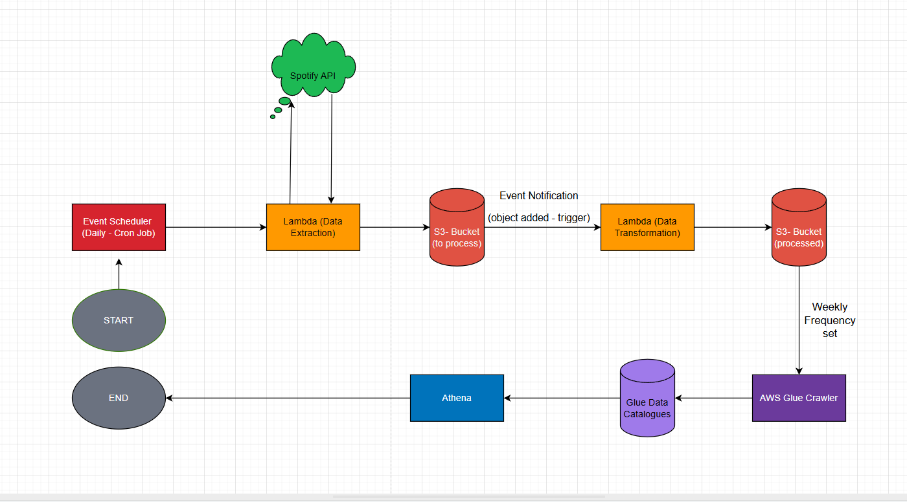

# Spotify-ETL-pipeline
In this project, we will build an ETL (Extract, Transform, Load) pipeline using the Spotify API on AWS and understand its various services and additional features. Backend Lambda calls Spotify API (often via Spotipy) using client credentials to fetch JSON payloads.




### Extraction Phase
1) **Event Scheduler:** It is a tool on AWS used to scheduling events (rate basis or time/cron basis). It has been used to run the Extraction events daily at 6:10 pm, by triggering the [Lambda Function (extraction)](data_extraction_function_lambda.py) containing the data extraction code.
2) **Lambda Function:** Event-driven compute service for lightweight, serverless backend tasks. Here, it calls the [Spotify API](https://developer.spotify.com/documentation/web-api) for data extraction which gives a raw string json output.
3) **Amazon S3:** Scalable cloud storage for backups, analytics, and static website hosting. Lambda function stores the raw output of API into a given folder in S3 Bucket.

### Transformation Phase
4) **S3 Event Notification:** It triggers actions when objects are created, deleted, or modified in buckets. Here, we set it up to call another [Lambda Function (transformation)](data_transformation_and_processing_function_lambda.py) which transforms the raw data stored and saves into another folder as processed data.

### Loading Phase
5) **AWS Glue Crawler:** It scans data stores, infers schemas, and populates the AWS Glue Data Catalog with table metadata. Here, it scans that processed data on weekly basis (variable as set by user) and forms table schemas by itself, storing the data in Glue Data Catalogs in a very well organised manner and adds to it new data without any duplication of old data.
6) **Glue Data Catalogs:** Stores the data crawled and processed by Glue Crawler.
7) **Amazon Athena:** Fast, serverless SQL queries over files and partitions in S3 for analytics. It is used to easily work with and analyse data in data catalogs using SQL. 

<br/>
<br/>
<br/>

Install Packages:
```
pip install pandas
pip install boto3
pip install spotipy
```

Error Handling:
> Lambda: 1) Make sure to provide proper role-permissions for S3 Bucket as well as its objects. Providing permissions to just object and not bucket might cause problems in transformation phase as function needs to list objects of that bucket and providing it objects access does not automatically make it have certain bucket permissions assigned. 2) Make sure to set proper time-outs. 3) Add additional packges used in the Layers section.

> S3: 1) Event Notification triggers for object PUT event should be set from a specific folder path where it is PUT, and not whole of bucket, as it might create a never-ending loop if the destination bucket is the same bucket. Or you can just set a different destination bucket. 2) Have the lambda function delete the raw data after it has processed it, else it would be processing same data again and again.


